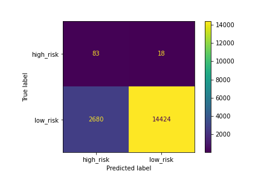

# Demo_Credit_Risk_Analysis
Analysis of Lending Club's credit card credit dataset to predict credit risk (an example of a "imbalanced" supervised classification ML problem)

## Background
Credit risk is an inherently unbalanced classification problem, as good loans easily outnumber risky loans.  Therefore, this analysis will employ different techniques to train and evaluate models with unbalanced classes using the imbalanced-learn and skikit-learn libraries

To address the unbalanced nature of this problem (many low-risk loans vs. few high-risk loans) this analysis will use various oversampling and undersampling methods to include: RandomOverSampler, SMOTE, ClusterCentroids, and SMOTEENN. All of these technques will be employed as a pre-processing step and assessed using the Logistics Regression Classifier

Additionally this analysis will investigate two ensemble learning methods, the BalancedRandomForestclassifier and the EasyEnsembleClassifer from the imbalanced-learn library

The following "data dictionary" was referenced to understand the many statuses in the Leading Club Dataset
[Leading Club Dataset Data Dictionary](https://help.lendingclub.com/hc/en-us/articles/215488038-What-do-the-different-Note-statuses-mean-)

## Deliverables / Analaysis

### Findings:
The logistics regression model using the over/under sampling techniques did not generate an acceptable model

The EasyEnsembleClassifier did the best in classifying the loan_status as high_risk with an f1 score of 0.16. While not a great model is performed the best out of those considered.

* Deliverable 1: Use Resampling Models to Predict Credit Risk
* Deliverable 2: Use the SMOTEENN Algorithm to Predict Credit Risk
* Deliverable 3: Use Ensemble Classifiers to Predict Credit Risk
* Deliverable 4: A Written Report on the Credit Risk Analysis 

### Deliverable 1: Use Resampling Models to Predict Credit Risk
* For all three algorithms, the following were completed:
  - An accuracy score for the model was calculated 
  - A confusion matrix was generated 
  - An imbalanced classification report was generated 

**Benchmark - No over/under sampling**
  - An accuracy score for the model was calculated as 0.9951
  - A confusion matrix was generated  
    

  - An imbalanced classification report was generated  
  - Note: The terms (from left to right are) pre is precision, rec is recall, spe is specificity, f1 is f1-score, geo is geometric mean, iba is index balanced accuracy and sup is support.
    

* **RandomOverSampler**
  - An accuracy score for the model was calculated as 0.8325
  - A confusion matrix was generated  
    

  - An imbalanced classification report was generated  
    
* **SMOTE**
  - An accuracy score for the model was calculated as 0.8325
  - A confusion matrix was generated  
    
  - An imbalanced classification report was generated  
    

* **ClusterCentroids**
  - An accuracy score for the model was calculated as 0.8325
  - A confusion matrix was generated  
    
  - An imbalanced classification report was generated  
    

### Deliverable 2: Use the SMOTEENN Algorithm to Predict Credit Risk
* The combinatorial SMOTEENN algorithm had the following:
**SMOTEENN**
  - An accuracy score for the model was calculated 0.8389
  - A confusion matrix was generated  
    
  - An imbalanced classification report was generated  
    

### Deliverable 3: Use Ensemble Classifiers to Predict Credit Risk
* The BalancedRandomForestClassifier algorithm does the following:
  - An accuracy score for the model was 0.759
  - A confusion matrix was generated  
    
  - An imbalanced classification report was generated  
    
  - The features were sorted in descending order by feature importance  
    

* The EasyEnsembleClassifier algorithm does the following:
  - An accuracy score of the model was 0.9319
  - A confusion matrix was generated  
    
  - An imbalanced classification report was generated  
    